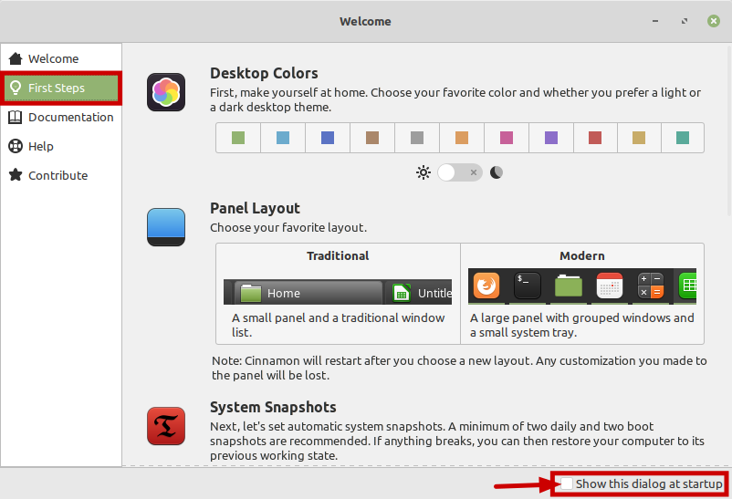
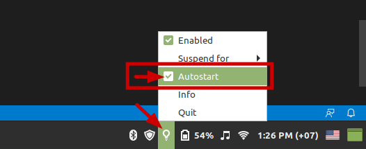

# ការងារ​ ដែល​គួរ​ធ្វើ​បន្ទាប់​ពី​ Install Linux Mint

**សម្គាល់ ៖** ប្រសិន​បើ​អ្នក​មិន​ចង់​ប្រើ​ script ឲ្យ​ set up Linux Mint ជំនួស​អ្នក​ទេ ឬ​អ្នក​ចង់​ set up Linux Mint ដោយ​ខ្លួន​ឯង​ អត្ថបទ​នេះ​ប្រហែល​ជា​អាច​ជួយ​អ្នក​បាន ។

## 1. ធ្វើ​តាម​ Welcome Screen

តាម​ការ​ពិត​ទៅ Welcome Screen របស់​ Linux Mint បាន​បង្ហាញ​ស្ទើរ​តែ​ទាំង​អស់​ទៅ​ហើយ នូវ​ការងារ​ ដែល​គួរ​ធ្វើ​បន្ទាប់​ពី install Linux Mint ។



ក្នុង​ជំពូក First Steps ៖
- (Optional) **Enable Dark mode** in “Desktop Colors”
- **“System Snapshots”**: Type → RSYNC; **Schedule → Weekly (Keep 3)**; Users → Exclude All Files; Filter → Exclude (-) All
- Install additional drivers using **“Driver Manager”**
- Update system using **“Update Manager”**
- Enable **“Firewall”**: Profile → Home; Status → Enable; Incoming → Deny; Outgoing → Allow
- Disable Show this dislog at startup

## 2. ធ្វើ​ឲ្យ​ថ្ម​កុំព្យូទ័រ​ប្រើ​បាន​យូរ​ជាង​មុន

មាន​ Package ពីរ​ឈ្មោះ tlp និង tlp-rdw ជួយ​ឲ្យ​ថ្ម​កុំព្យូទ័រ​ប្រើ​បាន​យូរ​ជាង​មុន ។ Run Command ខាង​ក្រោម​ដើម្បី install package ទាំងពីរ ៖

```bash
sudo apt update && sudo apt install tlp tlp-rdw && sudo tlp start
```

*សម្រាប់​អ្នក​ប្រើ​ Linux ដំបូង ៖ Run Command មាន​ន័យ​ថា​ សរសេរ​ Command (ពាក្យ ឬ​ឃ្លា ដែល​បញ្ជា​ឲ្យ​កុំព្យូទ័រ​ធ្វើ​អ្វី​មួយ) ក្នុង​ Terminal App ហើយ​ចុច*​ <kbd>Enter Key (↲)</kbd> ។

## 3. Enable Redshift ដើម្បី​ជួយ​សម្រួល​ដំណេក

Blue Ray ដែល​ចេញ​ពី​អេក្រង់​កុំព្យូទ័រ​ធ្វើ​ឲ្យ​អ្នក​មិន​ងងុយ​គេង និង​គេង​លក់​មិន​ស្កប់ស្កល់ ។ ការណ៍​នេះ​នឹង​ធ្វើ​ឲ្យ​សុខភាព​អ្នក​ទ្រុឌទ្រោម​ពិសេស​ អ្នក​ ដែល​សំឡឹង​អេក្រង់​កុំព្យូទ័រ​ច្រើន​នៅ​ពេល​យប់​មុន​ចូល​គេង ។ និយាយ​រួម​ Blue Ray មាន​ឥទ្ធិពល​ខ្លាំង​មក​លើ​សុខភាព​យើង​នៅ​ពេល​យប់ ។ ដូច្នេះ​ហើយ​បាន​ជា​គេ​ recommend ឲ្យ​ យើង​ទទួល​បរិមាណ​ Blue Ray ឲ្យ​បាន​តិច​បំផុត​មុន​ពេល​ចូល​គេង ។ Redshift ជា​កម្មវិធី​ ដែល​អាច​កំណត់​បរិមាណ​ Blue Ray ចេញ​ពី​អេក្រង់​កុំព្យូទ័រ​ ហើយ​បាន​ install ក្នុង Linux mint រួច​ជាស្រេច ។ ខាង​ក្រោម​នេះ​ជា​របៀប​ configure Redshift ៖

- បើក​ Redshift: Menu → Redshift
- Enable Autostart 



- Download [`redshift.conf`](link) ហើយ​ទុក​វា​ក្នុង​ `~/.config/` folder

`redshift.conf` នេះ​ជា​ configuration file ដែល​ជួយ​ Redshift ក្នុង​ការ​កំណត់​បរិមាណ​ Blue Ray ដែល​ត្រូវ​បញ្ចេញ​ពី​អេក្រង់​តាម​ពេល​វេលា​ក្នុង​ប្រទេស​កម្ពុជា ។

*ក្នុង Linux​, file ឬ​ folder ដែល​មាន​ឈ្មោះ​ផ្ដើម​ដោយ​ `.` ជា​ file ឬ​ folder កំបាំង​ ។ ចុច​ <kbd>Ctrl</kbd> + <kbd>H</kbd> ដើម្បី​បង្ហាញ​ ឬ​កម្បាំង​វា​ ។*