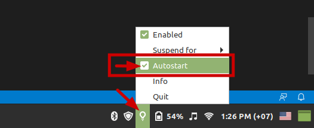
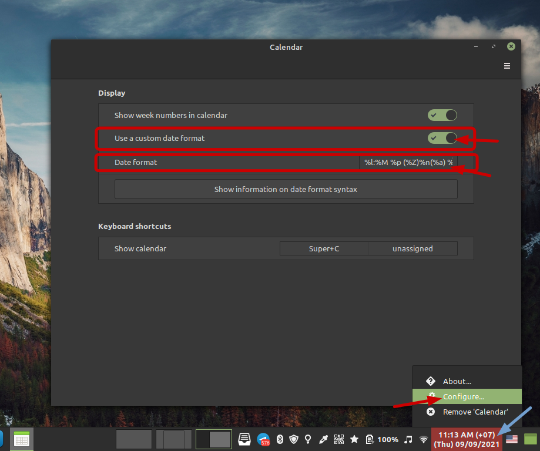
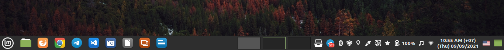

## Run

1. clone (this repo) or move script directory (SETUP_SCRIPT/) to (your) home directory of current user:

```
git clone https://github.com/Dimorng/SETUP_SCRIPT.git ~/SETUP_SCRIPT/
```
2. run script

```bash
cd ~/SETUP_SCRIPT/ && chmod +x setup.sh && sudo ./setup.sh
```
3. **IMPORTANT**: during script is running, after Bitwarden is installed, add SSH key to GitHub account (and deleted unused SSH Key). *SSH KEY IS STORED IN `~/Desktop/ssh_key_must_add_to_github`*.

## Command created after successully running script

Alias command created:
- `clean` : system clean up, equivalant to `sudo apt clean && sudo apt autoclean && sudo apt autoremove`
- `pbcopy path/to/file` : copy content of file to clipboard
- `pbpaste path/to/file` : paste content from clipboard

Command (shell function) created:
- `cLO` check lastest version of LibreOffice (.deb) available to download on official LibreOffice website
    - `cLO -U` update LibreOffice to the(/that) latest version (.deb)

## Tested with: 
- Linux Mint 20.1 (Ulyssa) Cinnamon Edition (on 4 May 2021)

## Complete the setup (manually done)

1. Setting Bitwarden
    - <kbd>Ctrl</kbd> + <kbd>,</kbd> to access setting
        - enable Minimize when copying to clipboard
        - Clear Clipboard: 10 seconds 


2. Assign Shortcut key for closing all open windows
    - Menu > Keyboard > Shortcut
    - Assign <kbd>Super</kbd> + <kbd>Backspace</kbd> to `~/Others/Apps/close-all-windows.sh`


3. Configure LibreOffice
    - install extensions in `~/Desktop/LOextension/`
        - SBBIC Khmer Spelling Checker
        - TexMath
    - add addtional preamble (in `~/Desktop/LOextension/extra-line-to-put-in-texmath-preamble-and-save-as-global`) of TexMath and Save as Global

    

    - enable Complex text layout and choose Khmer
        - Tools > Options > Language Settings > Languages > Complex text layout > Khmer

    

    - change Measurement unit to Centimeters
        - Tools > Options > LibreOffice * > General > Measurement unit > Centimeters

    

4. Welcome Screen

    Menu > Welcome Screen > First Steps:
    - create **_System Snapshots_**: leave everything as default except **Schedule: Weekly (Keep 3)**
    - install additional drivers using **Driver Manager**
    - Enable **Firewall**: 
        - Profile → Home
        - **Status → Enable**
        - **Incoming → Deny**
        - Outgoing → Allow 

    - disable Show this dislog at startup

    

5. Enable **Redshift Autostart**
    - Menu > Redshift
    - Redshift applet (left hand side panel) > autostart

    

6. Add Khmer Keyboard Layout and change switching layout shortcut
    - Menu → Keyboard → Layout → + → Khmer (Cambodia) → Add
    - Options... → Switching to another layout → **Both Shift Together** (fix conflict with LibreOffice shortcut <kbd>Shift</kbd> + <kbd>Crtl</kbd> + <kbd>Alt</kbd> + <kbd>v</kbd> [Paste Unformatted Text Shortcut])

    

7. Change Date Format
    - **disable 24h clock**: clock applet (left click) > Date & Time Settings > disable Use 24h clock

    

    - suggeted clock format on the panel: `%l:%M %p (%Z)`
        - clock applet (right click) > configure... > enable Use a custom date format > Date format: `%l:%M %p (%Z)`

        

    - suggeted clock format on the login screen top panel: `%a.%e.%b.%Y ⏲️ %l:%M %p (%Z)`
        - Menu > Login window > Settings > Clock format: `%a.%e.%b.%Y ⏲️ %l:%M %p (%Z)`

        

8. Customize bottom panel

    Recommended customize to look like this:

    

    - to arrange icons on left hand side panel, **just drag it**
    - to arrange icons on right hand side panel
        - **first enale Panel edit mode**
        - then arrange the applets by dragging it

        

9. Enable and disable some sounds
    
    Menu > Sound > Sounds:

    - sounds to **disable**:
        - Starting Cinnamon
        - Switching Workspace
    - sound to **enable**: **Showing Notification**

    

10. (Optional) Download songs:

```
git clone https://github.com/Dimorng/SongCollection.git ~/Music
```